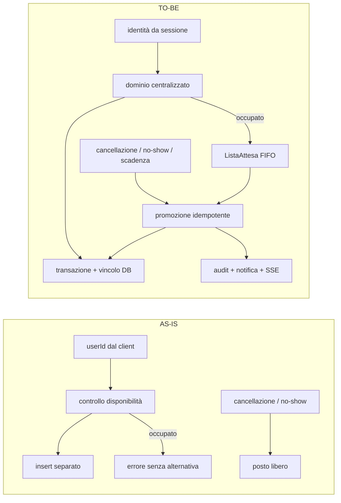

# Sottosistema prenotazioni — confronto AS-IS / TO-BE

## Vista affiancata

| Prospettiva | AS-IS | TO-BE |
|---|---|---|
| Componenti | [Diagramma componenti AS-IS](./prenotazione-componenti-as-is.md) | [Diagramma componenti TO-BE](./prenotazione-componenti-to-be.md) |
| Stati | [Diagramma stati AS-IS](./prenotazione-stati-as-is.md) | [Diagramma stati TO-BE](./prenotazione-stati-to-be.md) |
| Baseline | tag `baseline-pre-cr-bf-01` | `main` @ `76ecb1e` dopo Fase 6 e remediation finale |

I diagrammi AS-IS restano immutati come fotografia della baseline. I documenti
TO-BE rappresentano invece le dipendenze e le transizioni osservabili nel codice
finale; questa pagina li mette in relazione senza duplicarne il dettaglio.

## Differenze architetturali

| Area | AS-IS | TO-BE | Evidenza finale |
|---|---|---|---|
| Identità | Alcune route si fidano del `userId` client | Identità e ownership dalla sessione | `requireUser`, `requireRole`, `assertOwnership` |
| Validazione | Regole replicate nelle route | Regole centralizzate | `src/lib/prenotazioni-service.ts` |
| Atomicità | Verifica e inserimento separati | Transazione Serializable più vincolo DB | `creaPrenotazioneAtomica` e migrazione `EXCLUDE` |
| Coda | Entità e API assenti | `ListaAttesa`, API dedicata, unicità e FIFO | schema, `/api/prenotazioni/coda` |
| Promozione | Nessuna riassegnazione | Un solo servizio idempotente condiviso | `promuoviPrimoInCoda` |
| Cancellazione personale | Libera il posto soltanto | Libera e tenta la promozione | route `/api/admin/prenotazioni` |
| No-show | Libera il posto soltanto | Libera, promuove e traccia la catena | `automation-service` |
| Scadenza | `Prenotazione.SCADUTA` non raggiungibile | Promozione non confermata → scadenza e nuovo tentativo | `scadiPromozioniNonConfermate` |
| Cron | Run periodici senza coordinamento | Advisory lock e operazioni idempotenti | route `/api/cron/automations` |
| Audit | Eventi generici e non correlati | Eventi coda, attore e correlation ID | `LogEvento`, `eventi-coda` |
| Realtime | Helper e consumer scollegati | Ingresso/promozione notificati via SSE | `realtime-events`, `use-sse` |
| UI | Nessuna alternativa al conflitto | Ingresso/uscita coda e posizione | mappa, griglia mobile, pagina prenota |
| Statistiche | Ignorano la coda perché inesistente | Separano tempi e conversioni della coda | API e pagina statistiche |

## Evoluzione del flusso principale

## Ripple effect chiusi

1. Creazione, estensione e controllo conflitti condividono la semantica degli
   intervalli; il database impedisce sovrapposizioni anche in concorrenza.
2. Check-in e ownership non accettano richieste in coda come prenotazioni.
3. Cancellazione del personale, no-show e scadenza convergono sulla stessa
   promozione, senza duplicarne l'algoritmo FIFO.
4. Cron e transizioni usano lock o guardie di stato per non duplicare promozioni,
   notifiche e log.
5. Eventi e notifiche della coda sono aggiuntivi: i consumer preesistenti restano
   compatibili e i payload pubblici non espongono identificativi personali.
6. Le statistiche distinguono gli eventi della coda dai conteggi storici.

## Evidenza di verifica

La coerenza del TO-BE è supportata dai documenti di Fase 6:

- [specifica dei test post-modifica](../test/spec-post-modifica.md);
- [report delle parti modificate](../test/report-post-modifica.md);
- [report di regressione](../test/report-regressione.md);
- [verifica finale dei criteri](../test/verifica-finale-criteri-accettazione.md).

Questi report costituiscono l'evidenza eseguibile; i diagrammi ne rappresentano
la struttura e non introducono nuovi requisiti o comportamenti.
