# Componenti del sottosistema prenotazione — AS-IS

## Scopo

Questo documento descrive le dipendenze effettive del sottosistema prenotazione nella baseline precedente alla CR-BF-01. È stato ricavato manualmente dagli import, dalle chiamate HTTP e dagli accessi Prisma presenti nel codice al commit `7469969` di `main`.

- Task: [BIB-16 — Diagramma dei componenti del sottosistema prenotazione (AS-IS)](https://mariospaceforuni.atlassian.net/browse/BIB-16)
- Responsabile operativo: Renato Mancino, subentrato a Mario Celzo
- Baseline funzionale: tag `baseline-pre-cr-bf-01`
- Criteri di accettazione CR-BF-01: nessuno specifico; il documento alimenta l'impact analysis
- Documento complementare: [BIB-17 — diagramma delle transizioni di stato](./prenotazione-stati-as-is.md)
- Evidenza di regressione collegata: [specifica dei test pre-modifica](../test/spec-pre-modifica.md), integrata dalla task BIB-19

## Relazione con l'analisi AS-IS esistente

Questo elaborato non sostituisce il diagramma BIB-17 già presente nel repository. I due documenti osservano la stessa baseline da prospettive diverse:

| Documento | Domanda a cui risponde | Contenuto riusato qui |
|---|---|---|
| BIB-17 — `prenotazione-stati-as-is.md` | Quali stati e transizioni sono effettivamente raggiungibili? | Stati, attori e anomalie delle transizioni sono usati come riferimento, senza duplicarne il diagramma. |
| BIB-19 — `spec-pre-modifica.md` | Quali comportamenti originali devono restare verificabili? | Automazioni, notifiche e SSE forniscono evidenze eseguibili per alcuni collegamenti descritti sotto. |
| BIB-16 — questo documento | Quali componenti partecipano al sottosistema e come dipendono tra loro? | Mappa UI → API → servizi → Prisma, con accessi R/W/D e punti di impatto della CR. |

## Legenda degli accessi

- **R**: lettura del modello `Prenotazione`.
- **W**: creazione o aggiornamento del modello `Prenotazione`.
- **D**: eliminazione fisica del record.
- Le frecce rosse tratteggiate descrivono collegamenti **assenti** nella baseline, non dipendenze attive.
- I nodi rossi sono punti di impatto diretto della CR; quelli gialli sono ripple effect da adeguare o riverificare.

## Diagramma dei componenti

```mermaid
flowchart TB
    subgraph UI["UI utente e personale"]
        UI_BOOK["/prenota<br/>wizard e conferma"]
        UI_LIST["/prenotazioni<br/>lista, check-in, checkout, annulla"]
        UI_EXT["/prenotazioni/[id]/estendi"]
        UI_MAP["MappaBiblioteca<br/>MobilePostiGrid"]
        UI_ADMIN["/admin/prenotazioni<br/>pagina server e azioni"]
        UI_STATS["/admin/statistiche"]
    end

    subgraph HTTP["Route Next.js"]
        API_COLL["/api/prenotazioni<br/>GET e POST"]
        API_ITEM["/api/prenotazioni/[id]<br/>GET, PATCH e DELETE"]
        API_CHECK["/api/prenotazioni/[id]/check-in<br/>POST"]
        API_EXT["/api/prenotazioni/[id]/estendi<br/>GET e POST"]
        API_ADMIN["/api/admin/prenotazioni<br/>azioni personale"]
        API_STATS["/api/admin/statistiche<br/>aggregazioni"]
        API_ANOM["/api/admin/anomalie<br/>risoluzione no-show"]
        API_SCAN["/api/admin/scanner/validate<br/>check-in personale"]
        API_AVAIL["/api/disponibilita-giorni<br/>conteggi"]
        API_POSTI["/api/sale e /api/posti<br/>snapshot disponibilità"]
        API_CRON["/api/cron/automations"]
        API_SSE["/api/sse/posti"]
    end

    subgraph SERVICES["Servizi e infrastruttura"]
        AUTH["lib/auth<br/>sessione e ruoli"]
        AUTO["automation-service<br/>reminder e no-show"]
        REALTIME["realtime-events<br/>helper eventi posti"]
        SSE["sse-emitter<br/>stream e canali"]
        PRISMA["lib/prisma<br/>PrismaClient condiviso"]
        GAP_SERVER["ASSENZA AS-IS<br/>nessun flusso prenotazione<br/>chiama realtime-events"]
        GAP_CLIENT["ASSENZA AS-IS<br/>use-sse non usato<br/>da mappa o pagina prenota"]
    end

    subgraph DATA["Schema Prisma e persistenza"]
        PREN[(Prenotazione)]
        POSTO[(Posto e Sala)]
        USER[(User)]
        NOTIF[(Notifica)]
        LOG[(LogEvento)]
    end

    UI_BOOK -->|"GET sale e posti"| API_POSTI
    UI_BOOK -->|"POST payload con userId client"| API_COLL
    UI_BOOK -->|"passa snapshot e selezione"| UI_MAP
    UI_LIST -->|"GET lista"| API_COLL
    UI_LIST -->|"PATCH azioni"| API_ITEM
    UI_EXT -->|"GET slot e POST estensione"| API_EXT
    UI_ADMIN -->|"R diretto nel Server Component"| PRISMA
    UI_ADMIN -->|"POST azioni personale"| API_ADMIN
    UI_STATS -->|"GET aggregazioni"| API_STATS

    API_COLL -->|"R/W Prenotazione; W Notifica e Log"| PRISMA
    API_ITEM -->|"R/W/D Prenotazione; W Posto e Log"| PRISMA
    API_CHECK -->|"R/W Prenotazione e Posto"| PRISMA
    API_EXT -->|"R/W Prenotazione; W Notifica e Log"| PRISMA
    API_ADMIN -->|"R/W Prenotazione; W Posto, Notifica e Log"| PRISMA
    API_STATS -->|"R Prenotazione"| PRISMA
    API_ANOM -->|"R/W Prenotazione; W Posto, Notifica e Log"| PRISMA
    API_SCAN -->|"R/W Prenotazione e Posto; W Log"| PRISMA
    API_AVAIL -->|"R conteggi Prenotazione"| PRISMA
    API_POSTI -->|"R Sala e Posto"| PRISMA

    API_CHECK -->|"sessione e ownership"| AUTH
    API_ADMIN -->|"ruolo staff"| AUTH
    API_STATS -->|"ruolo staff"| AUTH
    API_ANOM -->|"ruolo staff"| AUTH
    API_SCAN -->|"ruolo staff"| AUTH
    API_AVAIL -->|"sessione"| AUTH
    AUTH -->|"R/W User per login e ultimo accesso"| PRISMA

    API_CRON -->|"invoca"| AUTO
    AUTO -->|"R/W Prenotazione; W Posto, Notifica e Log"| PRISMA

    API_SSE -->|"crea stream canale posti"| SSE
    REALTIME -->|"emette posto-update e occupazione-update"| SSE
    REALTIME -->|"R Sala e Posto per occupazione"| PRISMA
    GAP_SERVER -.-> REALTIME
    GAP_CLIENT -.-> API_SSE

    PRISMA -->|"mapping ORM"| PREN
    PRISMA -->|"mapping ORM"| POSTO
    PRISMA -->|"mapping ORM"| USER
    PRISMA -->|"mapping ORM"| NOTIF
    PRISMA -->|"mapping ORM"| LOG

    classDef ui fill:#dbeafe,stroke:#2563eb,color:#172554
    classDef direct fill:#fee2e2,stroke:#dc2626,color:#450a0a
    classDef indirect fill:#fef3c7,stroke:#d97706,color:#451a03
    classDef infra fill:#e5e7eb,stroke:#4b5563,color:#111827
    classDef data fill:#dcfce7,stroke:#16a34a,color:#052e16
    classDef gap fill:#fff1f2,stroke:#e11d48,color:#4c0519,stroke-dasharray: 6 4

    class UI_BOOK,UI_LIST,UI_EXT,UI_MAP,UI_ADMIN,UI_STATS ui
    class API_COLL,API_ITEM,API_CHECK,API_EXT,AUTH,PRISMA direct
    class API_ADMIN,API_STATS,API_ANOM,API_SCAN,API_AVAIL,API_POSTI,API_CRON,AUTO,REALTIME,SSE,API_SSE indirect
    class PREN,POSTO,USER,NOTIF,LOG data
    class GAP_SERVER,GAP_CLIENT gap
```

## Accessi al modello `Prenotazione`

| Componente | Accesso | Comportamento AS-IS | Effetto da considerare |
|---|---:|---|---|
| `src/app/api/prenotazioni/route.ts` | R/W | Elenca, verifica sovrapposizioni e crea; riceve `userId` dal payload. | Punto diretto per identità da sessione, validazione centralizzata e atomicità. |
| `src/app/api/prenotazioni/[id]/route.ts` | R/W/D | Dettaglio, check-in/out, cancellazione ed eliminazione fisica. | Duplica transizioni e non applica sessione/ownership nella baseline. |
| `src/app/api/prenotazioni/[id]/check-in/route.ts` | R/W | Check-in autenticato con ownership e finestra temporale. | Va riallineato alle regole centralizzate e ai nuovi stati. |
| `src/app/api/prenotazioni/[id]/estendi/route.ts` | R/W | Calcola slot e conflitti con una logica propria, poi estende. | Ripple effect: può reintrodurre sovrapposizioni e divergenza di validazione. |
| `src/app/api/admin/prenotazioni/route.ts` | R/W | Annulla, modifica e forza check-in; aggiorna anche posto, log e notifica. | Ripple effect: la cancellazione staff dovrà attivare la promozione della coda. |
| `src/app/api/admin/anomalie/route.ts` | R/W | Individua e risolve prenotazioni senza check-in. | Ripple effect sul no-show e sulla promozione idempotente. |
| `src/app/api/admin/scanner/validate/route.ts` | R/W | Legge la prenotazione da QR e forza check-in. | Deve rifiutare stati non eleggibili, inclusa la futura attesa. |
| `src/lib/automation-service.ts` | R/W | Invia reminder; trasforma `CONFERMATA` in `NO_SHOW` e libera il posto. | Ripple effect bloccante: il no-show dovrà promuovere il primo eleggibile. |
| `src/app/api/admin/statistiche/route.ts` | R | Aggrega stati e trend. | I nuovi stati/eventi non devono alterare metriche e classificazioni. |
| `src/app/admin/prenotazioni/page.tsx` | R | Il Server Component legge Prisma direttamente per costruire la lista. | Accoppiamento UI-persistenza da riverificare dopo schema e stati nuovi. |
| `src/app/admin/page.tsx`, `src/app/admin/anomalie/page.tsx` | R | Conteggi e liste per dashboard/anomalie. | Nuovi stati possono cambiare conteggi, filtri e segnalazioni. |
| `src/app/api/disponibilita-giorni/route.ts` | R | Conta prenotazioni attive per giorno. | La disponibilità futura dovrà distinguere confermate e richieste in attesa. |

## Dipendenze senza accesso diretto a `Prenotazione`

| Componente | Dipendenza effettiva | Osservazione AS-IS |
|---|---|---|
| `src/lib/auth.ts` | Usa `lib/prisma` per `User`; fornisce sessione e ruoli. | Solo check-in dedicato e route admin lo invocano. Le route generiche prenotazioni e l'estensione non derivano l'identità dalla sessione. |
| `src/app/prenota/page.tsx` | Chiama API sale, posti, profilo e prenotazioni. | Invia `session.user.id` nel JSON; non accede direttamente al DB. |
| `src/app/prenotazioni/page.tsx` | Chiama API lista e dettaglio per azioni utente. | Il filtro usa `utenteId`, mentre la route legge `userId`: dipendenza contrattuale incoerente da preservare come evidenza AS-IS. |
| `MappaBiblioteca` / `MobilePostiGrid` | Ricevono i posti via props da `/prenota`. | Non aprono uno stream SSE; rappresentano uno snapshot ottenuto da `/api/posti`. |
| `src/lib/sse-emitter.ts` | Mantiene stream e canali in memoria. | Non legge né scrive Prisma. |
| `src/lib/realtime-events.ts` | Importa `sse-emitter` e `lib/prisma` per statistiche di `Sala`/`Posto`. | Nessuna route o servizio di prenotazione chiama gli helper nella baseline; esistono ma sono scollegati dal flusso. |
| `src/hooks/use-sse.ts` | Espone `usePostiSSE()` verso `/api/sse/posti`. | Nessun componente UI lo importa nella baseline. |

## Punti di impatto diretto

1. **Identità e ownership.** `POST /api/prenotazioni` accetta `userId` dal client; le route generiche di dettaglio e l'estensione non usano `auth()`.
2. **Validazione duplicata.** Creazione, check-in ed estensione implementano controlli separati su stato, intervalli e sovrapposizioni.
3. **Atomicità assente.** La verifica della disponibilità e la creazione sono operazioni Prisma separate; non esiste un vincolo DB che impedisca due prenotazioni sovrapposte.
4. **Nuovo modello di attesa.** Schema Prisma, filtri e accessi al modello dovranno rappresentare una richiesta non ancora confermata senza renderla prenotabile o idonea al check-in.

## Ripple effect da dimostrare nelle fasi successive

1. **Cancellazione staff e utente:** oltre a liberare il posto dovrà promuovere la coda una sola volta.
2. **No-show automatico e amministrativo:** `automation-service` e anomalie admin scrivono direttamente `Prenotazione` e `Posto`; devono condividere la stessa promozione idempotente.
3. **Estensione:** la ricerca conflitti locale deve usare la stessa regola atomica della creazione.
4. **Scanner e check-in:** i nuovi stati non confermati devono essere rifiutati.
5. **Statistiche e dashboard:** nuovi stati e log non devono inquinare trend, no-show e conteggi.
6. **Realtime:** la baseline contiene emettitore, endpoint e hook, ma non il collegamento completo. La CR dovrà collegare le transizioni a eventi e consumatori senza rompere la mappa esistente.
7. **Notifiche e log:** le route e le automazioni li scrivono insieme alle transizioni, spesso fuori da una transazione; i nuovi eventi devono restare coerenti con lo stato persistito.

## Confini del documento

Il diagramma rappresenta le dipendenze osservate, non l'architettura desiderata. Non introduce il futuro `prenotazioni-service`, la lista d'attesa o nuovi enum: questi appartengono ai diagrammi TO-BE e alle fasi di implementazione. Nessun file applicativo è stato modificato per produrre questa analisi.
