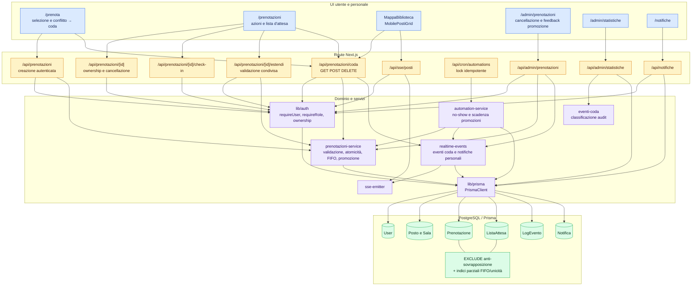

# Componenti del sottosistema prenotazione — TO-BE

## Scopo e riferimenti

Questa vista descrive l'architettura effettiva dopo CR-BF-01, verificata sul
codice finale di `main` alla baseline `76ecb1e`. Completa, senza sostituirla,
l'analisi [AS-IS dei componenti](./prenotazione-componenti-as-is.md).

- Task: [BIB-64](https://mariospaceforuni.atlassian.net/browse/BIB-64)
- Prerequisito: documenti e verifiche di Fase 6 integrati in `main`
- Vista complementare: [stati TO-BE](./prenotazione-stati-to-be.md)
- Confronto sintetico: [AS-IS / TO-BE](./confronto-prenotazioni-as-is-to-be.md)

## Diagramma dei componenti

## Responsabilità consolidate

| Componente | Responsabilità TO-BE | Garanzia principale |
|---|---|---|
| `src/lib/auth.ts` | Identità, ruolo e ownership derivati dalla sessione | CA-01; niente identità autorevole dal payload |
| `src/lib/prenotazioni-service.ts` | Intervalli, conflitti, transazioni, coda FIFO e promozione | CA-02, CA-03 e CA-04 in un solo dominio |
| `Prenotazione` + migrazione SQL | Persistenza delle prenotazioni attive | Exclusion constraint su posto/data/intervallo |
| `ListaAttesa` | Richiesta distinta dalla prenotazione | Unicità parziale `IN_ATTESA` e ordine `createdAt, id` |
| Route `/api/prenotazioni/coda` | Ingresso, elenco con posizione e annullamento | Operazioni autenticate e ownership |
| `automation-service` | No-show, scadenza delle promozioni e nuova promozione | Effetti idempotenti e audit correlato |
| Route cron | Serializzazione dei run tramite advisory lock | Nessuna doppia elaborazione concorrente |
| `realtime-events` / SSE | Aggiornamento coda e notifica personale | Payload pubblico senza identificativi di terzi |
| Notifiche e `LogEvento` | Tracciabilità di ingresso, promozione, scadenza e annullamento | CA-05 e correlazione delle catene automatiche |

## Flussi principali

1. La route di creazione ricava l'utente dalla sessione e delega la scrittura
   atomica al servizio di dominio; il vincolo PostgreSQL resta l'ultima difesa.
2. In caso di intervallo occupato, la UI propone la coda e la route dedicata crea
   una `ListaAttesa` `IN_ATTESA`, con posizione FIFO calcolata dal dominio.
3. Cancellazione del personale o no-show liberano lo slot e invocano la stessa
   funzione `promuoviPrimoInCoda`; la promozione crea una `Prenotazione`,
   aggiorna la richiesta e registra `CODA_PROMOZIONE` nella medesima transazione.
4. Una promozione non confermata tramite check-in scade; automazione, notifica,
   audit e promozione del successivo chiudono il ciclo della coda.
5. Gli eventi SSE aggiornano mappa e pannello coda; i dettagli personali viaggiano
   soltanto sul canale autenticato del destinatario.

## Confini

Il diagramma rappresenta dipendenze presenti nel codice finale. Non attribuisce
a `ListaAttesa` lo stato di una prenotazione: le due entità mantengono cicli di
vita separati e vengono correlate dall'audit `CODA_PROMOZIONE`.
