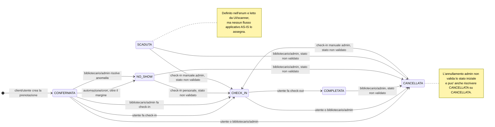

# Stati di `Prenotazione` — AS-IS

Questo documento descrive le transizioni effettivamente implementate nella baseline
precedente alla CR-BF-01. Gli stati provengono dall'enum `StatoPrenotazione` in
`prisma/schema.prisma`.

Il diagramma distingue il flusso ordinario dalle transizioni anomale che il codice
attuale consente per assenza di un controllo sullo stato di partenza. Queste ultime
non rappresentano il comportamento desiderato: sono parte dell'analisi AS-IS.

## Evidenze nel codice

| Stato iniziale | Stato finale | Attore | Evidenza AS-IS |
|---|---|---|---|
| nuovo record | `CONFERMATA` | client/utente | `POST /api/prenotazioni` crea esplicitamente la prenotazione come `CONFERMATA`; l'identita' arriva attualmente dal payload. |
| `CONFERMATA` | `CHECK_IN` | utente | `PATCH /api/prenotazioni/[id]` con azione `check-in` e `POST /api/prenotazioni/[id]/check-in`; entrambi richiedono lo stato `CONFERMATA`. |
| `CONFERMATA` | `CHECK_IN` | bibliotecario/admin | `POST /api/admin/prenotazioni` con azione `CHECK_IN_MANUALE` e `POST /api/admin/scanner/validate`. |
| `CHECK_IN` | `COMPLETATA` | utente | `PATCH /api/prenotazioni/[id]` con azione `check-out`; l'azione richiede lo stato `CHECK_IN`. |
| `CONFERMATA` | `NO_SHOW` | automazione/cron | `releaseNoShowReservations()` in `src/lib/automation-service.ts`, invocata dall'endpoint cron, seleziona solo prenotazioni `CONFERMATA`. |
| `CONFERMATA` | `NO_SHOW` | bibliotecario/admin | Azione `ANNULLA_PRENOTAZIONI_SENZA_CHECKIN` in `src/app/api/admin/anomalie/route.ts`. |
| `CONFERMATA`, `CHECK_IN` | `CANCELLATA` | utente | `PATCH /api/prenotazioni/[id]` con azione `cancella`; gli altri stati vengono rifiutati. |
| qualunque stato | `CANCELLATA` | bibliotecario/admin | Le azioni `ANNULLA_SINGOLA` e `ANNULLA_MULTIPLE` in `src/app/api/admin/prenotazioni/route.ts` non controllano lo stato iniziale. Nel diagramma sono mostrate solo le transizioni che cambiano effettivamente valore. |
| `CANCELLATA`, `NO_SHOW`, `SCADUTA` | `CHECK_IN` | bibliotecario/admin | `CHECK_IN_MANUALE` rifiuta soltanto `CHECK_IN` e `COMPLETATA`; lo scanner rifiuta `CANCELLATA` e `SCADUTA`, ma non `NO_SHOW`. Queste transizioni sono quindi tecnicamente raggiungibili. |

## Stati terminali e stato non raggiungibile

Nel flusso ordinario `COMPLETATA`, `CANCELLATA` e `NO_SHOW` sono terminali. Le
azioni amministrative prive di validazione possono tuttavia riaprire o sovrascrivere
parte di questi stati, come indicato nel diagramma.

`SCADUTA` non ha alcuna transizione entrante implementata: compare nell'enum, nei
tipi TypeScript, nei filtri dell'interfaccia amministrativa e nelle verifiche dello
scanner, ma non viene mai scritto da una route, un servizio o il seed attuale.

La route `DELETE /api/prenotazioni/[id]` elimina fisicamente il record senza assegnare
uno stato dell'enum; per questo non e' rappresentata come transizione di stato.
