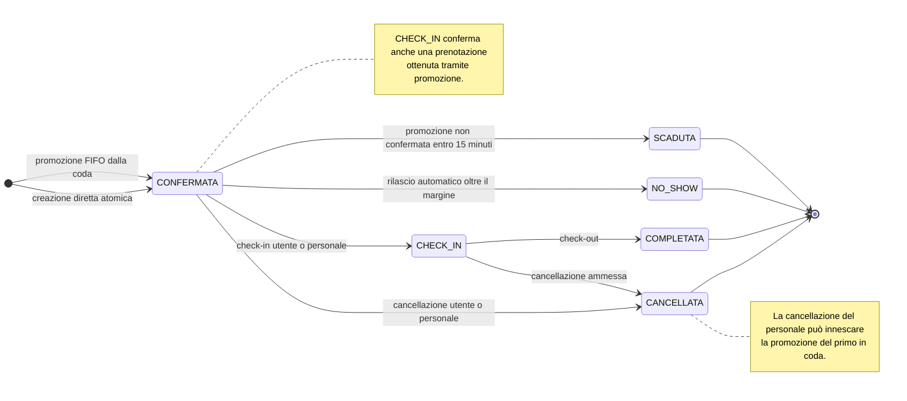
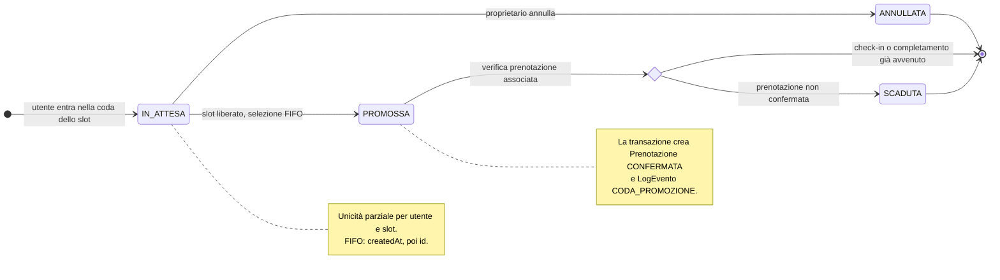
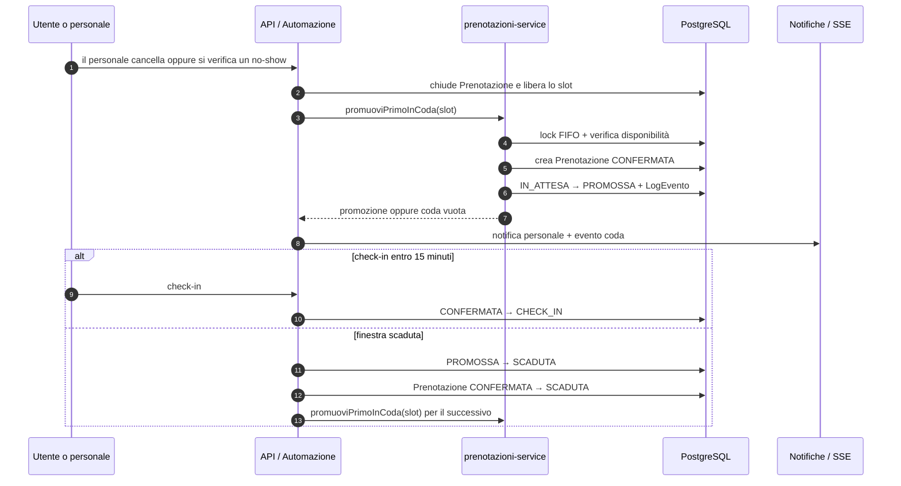

# Stati di prenotazione e lista d'attesa — TO-BE

## Scopo e convenzioni

Il TO-BE distingue le due entità persistenti introdotte o modificate dalla
CR-BF-01. `ListaAttesa` non è uno stato di `Prenotazione`: una prenotazione nasce
solo dalla creazione diretta riuscita o da una promozione FIFO.

- Analisi precedente: [stati Prenotazione AS-IS](./prenotazione-stati-as-is.md)
- Architettura aggiornata: [componenti TO-BE](./prenotazione-componenti-to-be.md)
- Confronto: [AS-IS / TO-BE](./confronto-prenotazioni-as-is-to-be.md)

## Ciclo della prenotazione

## Ciclo della lista d'attesa

## Coordinamento fra i due cicli

## Transizioni e garanzie

| Entità | Da | A | Innesco | Effetti osservabili |
|---|---|---|---|---|
| `ListaAttesa` | nuovo | `IN_ATTESA` | ingresso autenticato | `CODA_INGRESSO`, notifica, posizione FIFO |
| `ListaAttesa` | `IN_ATTESA` | `ANNULLATA` | proprietario | `CODA_ANNULLATA` |
| `ListaAttesa` | `IN_ATTESA` | `PROMOSSA` | cancellazione, no-show o scadenza precedente | nuova `Prenotazione`, `CODA_PROMOZIONE`, notifica/SSE |
| `ListaAttesa` | `PROMOSSA` | `SCADUTA` | nessun check-in entro la finestra | `CODA_SCADENZA`, rilascio e tentativo sul successivo |
| `Prenotazione` | nuovo | `CONFERMATA` | creazione o promozione | transazione Serializable e vincolo DB |
| `Prenotazione` | `CONFERMATA` | `CHECK_IN` | utente autorizzato/personale | posto occupato e audit |
| `Prenotazione` | `CHECK_IN` | `COMPLETATA` | check-out | chiusura ordinaria |
| `Prenotazione` | attiva | `CANCELLATA` | utente | chiusura; rilascio del posto se era in `CHECK_IN` |
| `Prenotazione` | attiva | `CANCELLATA` | personale | rilascio e possibile promozione |
| `Prenotazione` | `CONFERMATA` | `NO_SHOW` | cron | rilascio e possibile promozione |
| `Prenotazione` | `CONFERMATA` promossa | `SCADUTA` | mancata conferma | rilascio e possibile promozione successiva |

Le transizioni automatiche usano guardie sullo stato atteso e transazioni
Serializable. Un secondo run non ripete gli effetti già persistiti; il vincolo
di esclusione impedisce comunque due prenotazioni attive sovrapposte.
